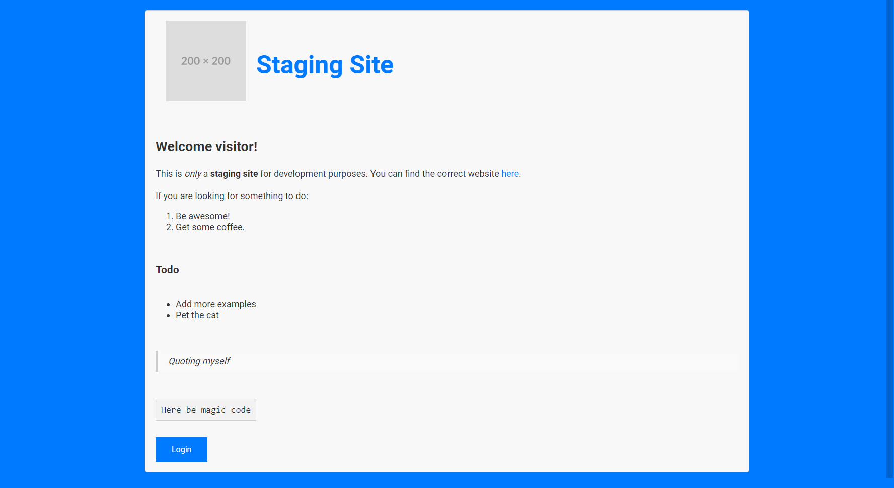
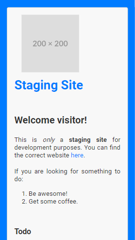
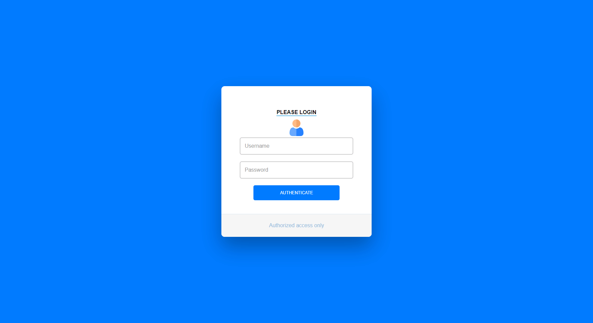
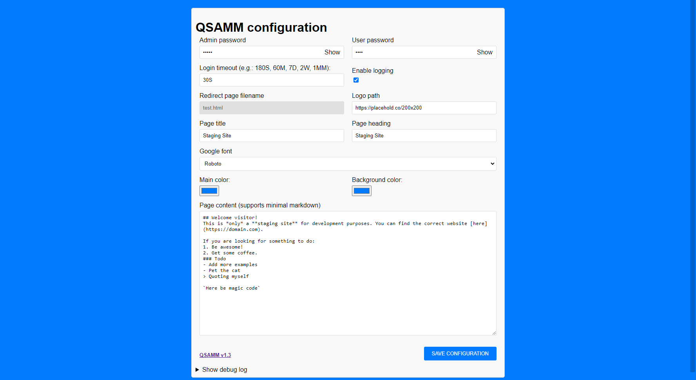

# QSAMM - Quick Staging Access and Maintenance Mode


QSAMM is an quick and easy solution for staging / development sites and maintenance mode - all in a single PHP script. Up and running in less than a minute. Works on any webserver that supports htaccess and PHP.
By default, all access to yourdomain.com is blocked (except loading a few image types and accessing the information page / admin page). Once a user authenticates himself through login in with a valid password, the user's IP address is allowed to access the regular website. 

## Features
- ⏩ **Quick and easy installation and configuration**: Upload the file and configure it through a web interface.
- 🌍 **Multilingual Support**: Simple translation built-in. By default it includes English and German but you can add any language you want.
- 🔓 **User Authentication**: One password to allow access to the protected site and another to access the web interface.
- 😎 **Privacy first**: No external libraries or fonts will be loaded (unless you select a Google font). No cookies will be set.
- 🎨 **Full customization**: You can use the script as-is or customize every part of it to your liking.


### 💻 Desktop version

### 📱 Mobile version

### Login

### Configuration


## Installation
1. Download the latest version index.php and place it into a subfolder on your webspace. If your website root path is ```/var/www/public_html```, create a subfolder ```login``` and place the index.php into it. You can use any subfolder name you like, it doesn't have to be ```login```.
2. Browse to https://yourdomain.com/login
3. Fill out all fields. The page content does support minimal markdown for formatting.
4. Upon saving, you will be redirected to the login form. The configuration is done. If you access https://yourdomain.com now, you will be shown the information page you designed. The login button at the bottom takes you back to the login form to change settings or authenticate a user.

- The timeout for whitelisted IP addresses allow time to be entered as S(econds), M(inutes), H(ours), D(days) or MM(onths). So 60S for 60 seconds or 7D for 7 days.
- IP-addresses that are older than the configured timeout in the .htaccess will be removed automatically each time the login page is opened.
- You can either give a full URL to the logo file or provide the filename / path to it. If your logo is https://yourdomain.com/logo.webp, you can just write logo.webp into the configuration.
- To avoid any GDPR (DSGVO) issues, you can select the Browser default font. This will use the default font of the browser instead of a Google Font.

## Usage
Once configured, every visitor will be shown the information page. You can then provide your customers the configured user password. They can then click the Login button at the bottom of the information page, enter any username (this is mainly for you to see who used the system) and the user password. After that, they will be redirected to the regular website.

## 🛑 Note
Every time you save the configuration on the admin page, the redirect page will be overwritten. Keep this in mind in case you did customize it further. The redirect page filename can't be changed via the web interface after the initial setup. You can change it in your .htaccess and the config.php if you really need to.

## Supported markdown
``` 
# Heading
Heading 1 -> converted to <h1>Heading</h1>
## Heading 
Heading 2 -> converted to <h2>Heading</h2>
###	Heading
Heading 3 -> converted to <h3>Heading</h3>
#### Heading 
Heading 4 -> converted to <h4>Heading</h4>
##### Heading 
Heading 5 -> converted to <h5>Heading</h5>
###### Heading
Heading 6 -> converted to <h6>Heading</h6>

** Text **
Bold text -> converted to <strong>text</strong>

* Text * 
Italic text -> converted to <em>text</em>

1. Item 1
Ordered list -> converted to <ol><li>Item 1</li></ol>

- Item 1
Unordered list -> converted to <ul><li>Item 1</li></ul>

[Link text](URL)
Link -> converted to <a href="URL">Link text</a>


Image -> converted to 

`Code`
Inline Code -> converted to <code>Code</code>

\n
Newlines -> converted to <br>

```

## 🌍 Localization
To modify the translation or add your own you need to edit the index.php. Look for this code block.

```PHP
// Define translations
$translations = [
  'de' => [ 
      'QSAMM configuration' => 'QSAMM Konfiguration',
      'Admin password' => 'Administrator-Passwort',
      'User password' => 'Benutzer-Passwort',
	  [...]
  ],
];
```
You can either modify the translations for your language or add another one. Use the [2-letter ISO code](https://en.wikipedia.org/wiki/ISO_3166-1_alpha-2) for the language you like to add. The script will automatically use the browsers language to show the correct translation. If the translation doesn't exist, it will show the english version.

```PHP
// Define translations
$translations = [
  'de' => [ 
      'QSAMM configuration' => 'QSAMM Konfiguration',
      'Admin password' => 'Administrator-Passwort',
      'User password' => 'Benutzer-Passwort',
	  [...]
  ],
  'fr' => [ 
      'QSAMM configuration' => 'QSAMM configuration',
      'Admin password' => 'mot de passe administrateur',
      'User password' => 'Mot de passe de l'utilisateur',
	  [...]
  'pl' => [ 
      'QSAMM configuration' => 'QSAMM konfiguracja',
      'Admin password' => 'hasło administratora',
      'User password' => 'hasło użytkownika',
	  [...]	  
];
```
## Technical details
- **Logging**: If logging is enabled, you can find the logfile at https://yourdomain/login/debug.log. Direct access to the file through the browser is blocked. You can download it via FTP, check the content via ssh or see the last 20 entries in the web interface.
- **Backups**: Every time you save the configuration, a backup of the previous .htaccess file is placed in https://yourdomain.com/login/backups

## Contributing
Contributions are welcome!

## Support
If you encounter any issues or have questions, feel free to open an issue on the GitHub repository.
